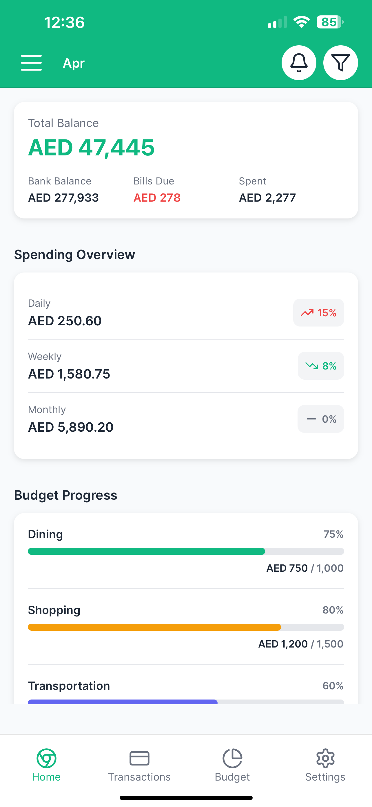
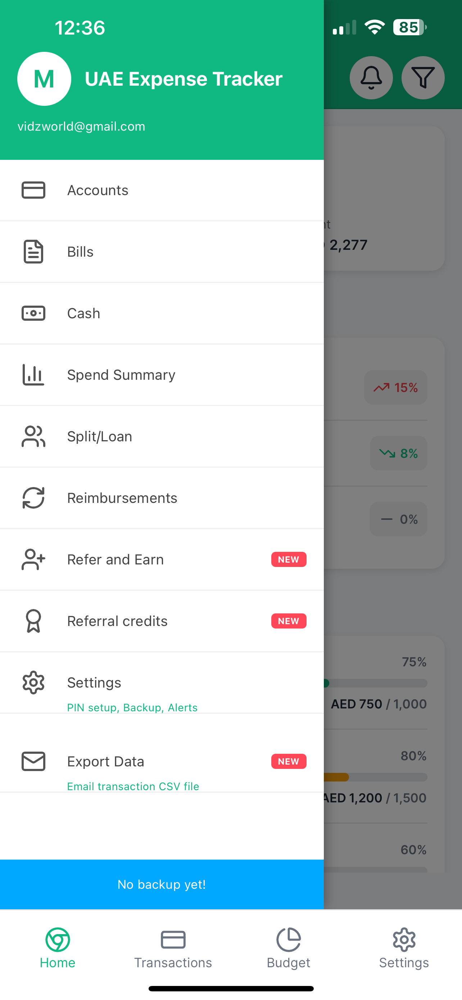
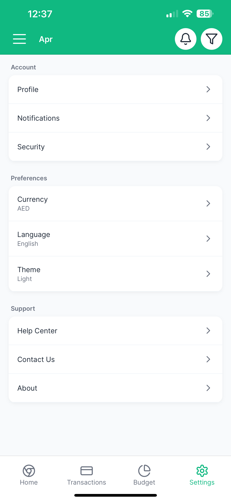

# UAE Money Expense Tracker

**UAE Expense Tracker** is a smart and secure expense tracker app designed specifically for users in the UAE. It automatically tracks your expenses by 📩 **reading transaction SMS alerts from your banks sms in your phone**, categorizes them, and gives you powerful insights into your spending patterns.

## 🚀 Features

- 📲 **Automatic Expense Tracking**: Detects debit and credit transactions from SMS alerts and updates your expenses automatically.
- 🏦 **Multi-Bank Support**: Add multiple bank accounts to get a full picture of where your money is going.
- 🗂️ **Smart Categorization**: Automatically categorizes expenses into Dining, Shopping, Transportation, and more.
- 🔐 **Privacy First**: We never store or use full account numbers. Only the last 4 digits are used to identify accounts.
- 🧑‍💼 **Secure Access**: Protect your app with PIN code or Face ID authentication.
- 📊 **Detailed Insights**:
  - Track daily, weekly, and monthly spending
  - Visual progress of your budget vs actual spend
  - Alerts and summaries
- 📤 **Export Data**: Export your transaction data in CSV format for analysis or backup.

## 📷 Screenshots

| Home & Overview | Side Menu | Settings |
|-----------------|------------|----------|
|  |  |  |

> **Note**: More screenshots can be added to showcase individual features.

## 🔧 Getting Started

This app is currently built for mobile (iOS/Android) and will soon be available on the respective app stores. For now, it's under active development.

## 🛡️ Security

- App does **not store** or transmit your sensitive banking info.
- Only the **last 4 digits** of your account number are used.
- All data is stored **locally on your device**.
- You can enable **Face ID or PIN protection** for secure access.

## 📬 Contact

For support or feedback, please reach out to: `vidzworld@gmail.com`

---

### 🙌 Contributions Welcome!

Have ideas, feature suggestions, or found a bug? Feel free to open an issue or a pull request.

---

### 📄 License

This project is licensed under the MIT License. See the [LICENSE](LICENSE) file for details.
